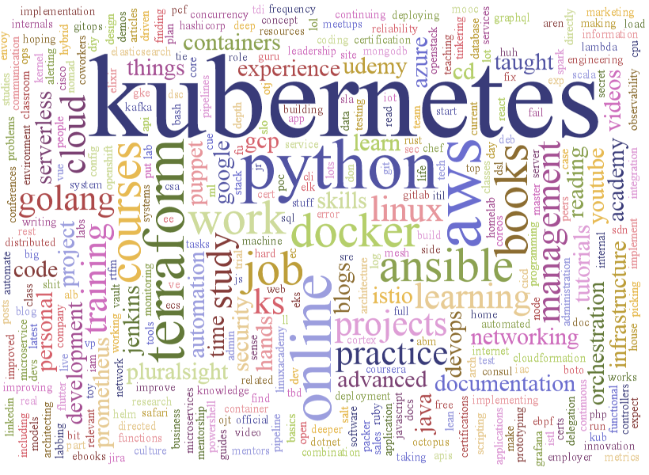
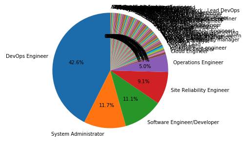
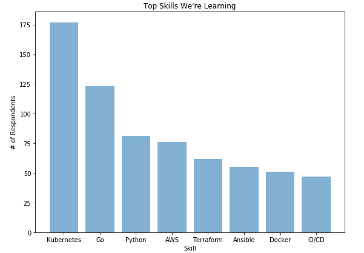
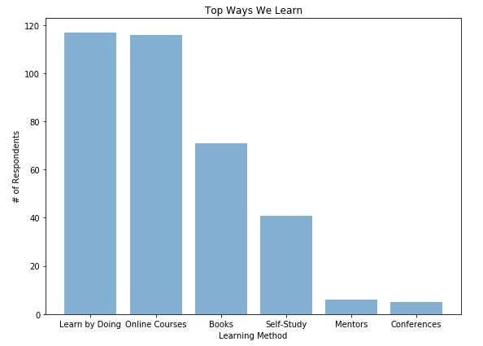

# The DevOps Career Growth Survey Results Are Here!

As soon as I published the "DevOps Career Growth Survey" on reddit and Slack, I immediately got feedback from curious respondents who wanted the results. Well, over 450 people took the survey and the results are in!

## Key Takeaways

DevOps Engineer is the most common job title of those who took the survey.

Kubernetes is a big deal. Everyone wants to learn it. 

People learn in many ways, most commonly "learning by doing" (25%) and taking online courses (25%). Many also stated they like learning from books (15%).

Those taking online courses are using a smal from a small number of online learning platforms, including:

- Pluralsight
- Udemy
- Linux Academy
- Lynda/LinkedIn Learning
- CloudAcademy
- A Cloud Guru

Ultimately, what can we make of this? If you want more details, read on.

## What are we learning?

There are noticeable trends in what respondents want to learn. Tools that stand out way beyond the others. The survey results showed that, regardless of job title, the following skills are what people want to learn in 2019: 

1. Kubernetes (this crushed every other option - a whopping 38% of respondents said they plan to learn Kubernetes this year, with almost 25% of respondents listing it first in their skills list)
2. Go (27%%)
3. Python (18%)
4. AWS (16%)
5. Terraform (13%)
6. Ansible (12%)
7. Docker (11%)

But you might be asking yourself, "yeah okay, but who is more likely to want to learn what?" Here's the breakdown: 

| **Job Title**               | **Tools**           |
| --------------------------- | --------------------|
| Site Reliability Engineer   | Go                  |
| System Administrator        | AWS, Docker, Python |
| Operations Engineer         | Python              |
| DevOps Engineer             | Python, Ansible, Go |
| Software Engineer/Developer | AWS, Terraform      |

_Side note: I love how ambitious DevOps Engineers are, wanting to learn two programming languages in one year!_

It's clear that the tool to learn in 2019 is Kubernetes. _Everyone_ wants to learn Kubernetes.

That said, it's not just tools that respondents are interested in learning. They are also interested in concepts. The concepts that interest them the most are:

- CI/CD
- Software development
- Architecture (particularly Microservices and distributed systems)
- Monitoring
- Networking
- Leadership
- Social/communication skills

## Does this match what the industry says it wants?

There is some overlap between the top skills respondents said they want to learn this year and what the industry says it wants, but not as much as I was expecting.

For example, according to [CloudAcademy's Job Roles Matrix for DevOps Engineers](https://cloudacademy.com/cloud-roster/devops-engineer/), the top five skills that are trending in the role are:

1. AWS
2. Java
3. Python
4. Linux
5. Jenkins

Only two of the five skills overlap (AWS and Python), but most importantly, where's the Kubernetes? Kubernetes is 13th on this list, below skills infrequently mentioned in the survey (e.g. SQL, JavaScript) as well as skills barely mentioned in the survey like Chef and Puppet. Also, Go isn't on CloudAcademy's list at all - but clearly folks who responded to the survey want to learn it. Why might that be?

There was also limited overlap between concept skills from industry publications and the survey results.

For example, in 2018 the DevOps Institute shared their thoughts on [the five most lucrative skills in DevOps](https://devopsinstitute.com/2018/01/05/5-devops-skills-that-lead-to-higher-salaries/), which only had two overlapping skills: CI/CD and Leadership. A [different article from 2018](https://medium.com/@SpinnakerSummit/4-most-in-demand-devops-skills-to-get-hired-in-2018-659c4d7cbd9a) shared that the most in demand skills are cloud platforms, people skills, customer-first mindset, and problem solving. While a few respondents mentioned improving their people skills (~1%), and many called out the specific cloud platforms they are learning, there were no mentions of customer-first mindset or broad problem-solving skills.

Both of the above articles also gave shout-outs to security, but only 18 survey respondents (less than 5%) said they were planning on learning about security this year.

Lastly, almost nothing in the literature I could find calls out knowledge of architectural patterns as required skills, but 7% of respondents said they were interested in learning more about microservices or distributed systems architectures.

Ultimately, what this tells me is that there are a lot of voices echoing into the DevOps void. Furthermore, many folks writing articles about DevOps are not technical practitioners themselves and have limited understanding of both current and future trends. Is DevOps a business problem? Is it a technical one? What really is DevOps? Can "DevOps Engineer" really be a job title? All of the echoing, the lack of cohesion in the DevOps space, can be confusing and makes it difficult to start learning about DevOps.

But these survey results are clear: Learn about continuous integration and continuous delivery (CI/CD). Learn a popular programming language like Python or Go. Learn how to use cloud providers like AWS, GCP, and Azure. And yes, learn Kubernetes.

_What do you think? Why does everyone want to learn Kubernetes? Why are you learning what you're learning? Email me at fkdema@gmail.com or message me on Slack or Twitter with your thoughts._

_Are you are interested in learning more about microservices? Check out my course, [DevOps Foundations: Microservices](https://www.linkedin.com/learning/devops-foundations-microservices) and I'll give you 3 months of LinkedIn Learning for free. Contact me and I’d be happy to give you a code - until they run out!_